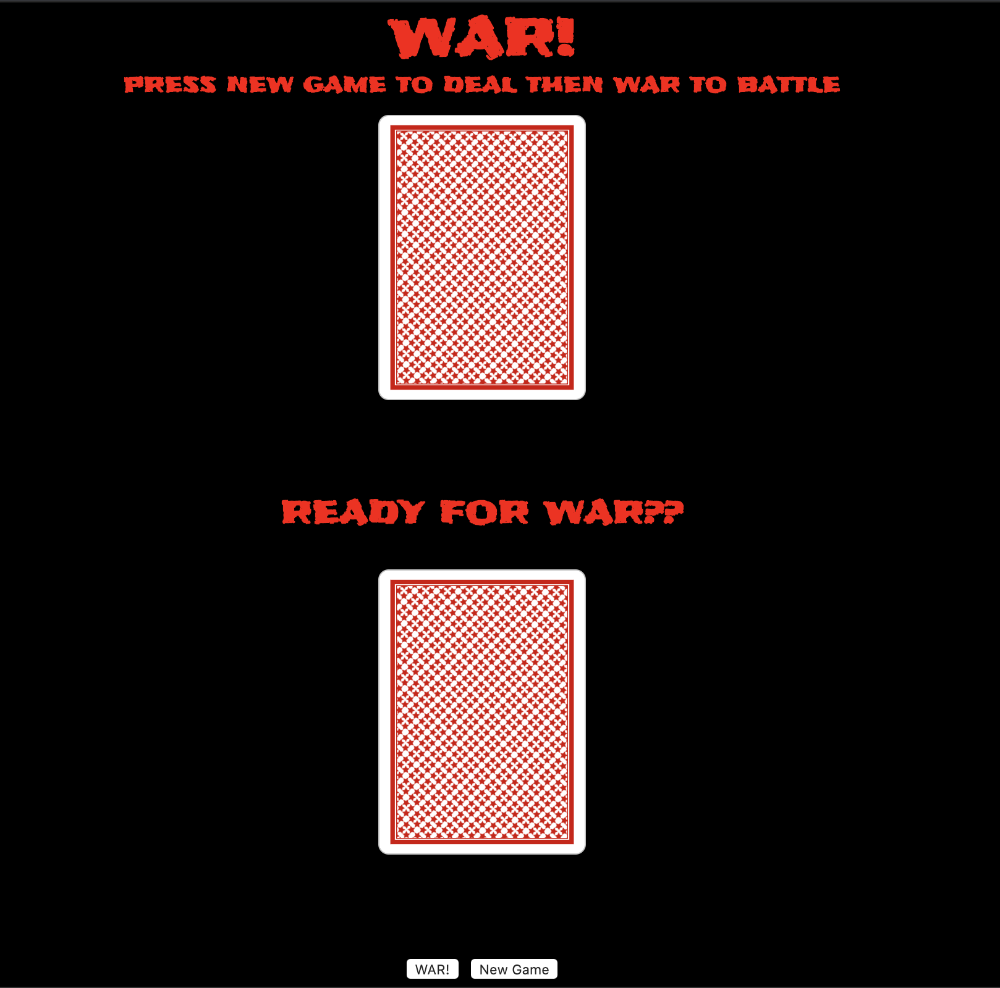
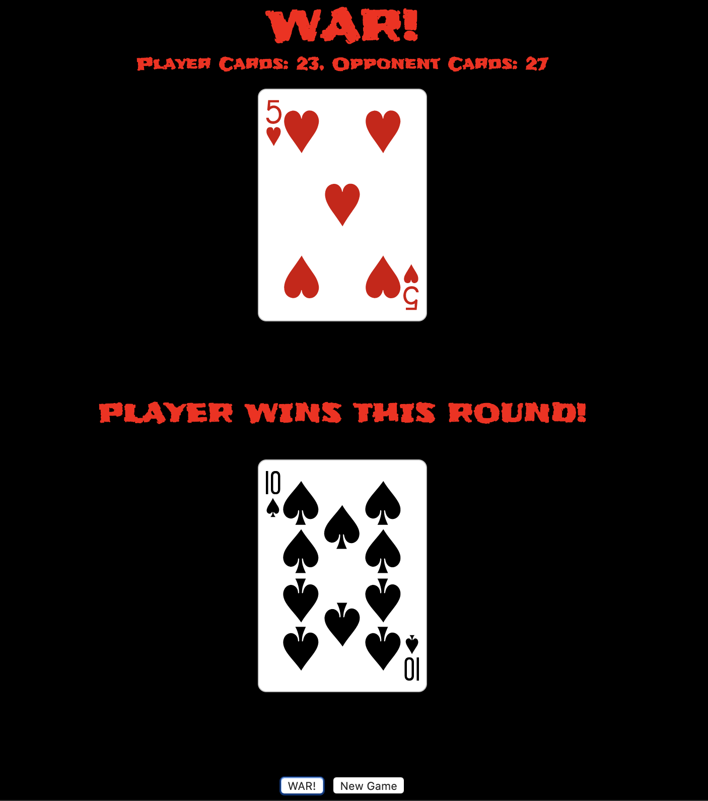

# War
War is a simple-to-play card game that is typically played with two players.  The deck is shuffled and each player gets an even amount of cards.  At the same time both players flip their top card and the player who flips the higher value card keeps the cards that were played and these cards move to the bottom of the winner's deck. This is typically called a battle.  

When players flip the same card and tie, they begin a war.  Each player then puts two additional cards face down and a third face up for a total of 8 cards in play.  The player to flip the higher face up card, keeps all 8 cards that were played.

In this version of war, the face down cards are played, but only the final, face up card is shown on the user interface.  

To win you must take all of your opponents cards.  

## Screenshots

## Technologies Used

- HTML
- CSS
- JavaScript

## Getting Started

To play this game click [here](https://chris-violante.github.io/War-Game-Project-1/)

Instructions to get the game started are at the beginning of the game

Once started the object of the game is to flip a card with a higher value than your opponent.  An Ace is the most valuable card descending to a 2.  Suit does not matter. 

## Planned Future Enhancements

-Enhanced scoring system with user selectable win amount for quicker game play.

-Game theme selection

-Gameplay sound

-War card animation